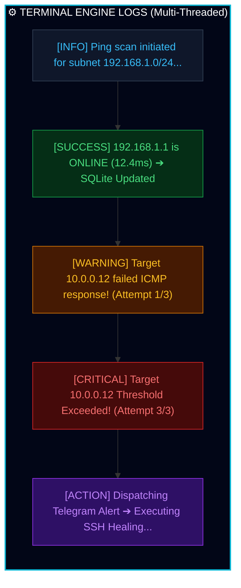

# 📡 Dawit Telecom Enterprise Network Health & Automated Self-Healing Suite
> **Executive Presentation Deck & System Architecture Specification**

---

## 👨‍💻 Presenter & Lead Architect Profile

* **Lead Systems Architect & Automation Engineer:** **Dawit Niguse (ዳዊት ንጉሴ)**
* **Domain:** Enterprise Telecom Infrastructure, Network Automation, Resilience & Self-Healing Architecture
* **Stack:** Python Async Multi-Threading, Flask REST/Web Engine, SQLite Telemetry, Paramiko SSH Automation, Telegram Bot API
* **Target Environment:** Enterprise Cross-Platform Infrastructure (Linux / Windows / Server)

---

## 🎯 Executive Summary & Mission Statement

Modern telecom networks require continuous, uninterrupted runtime with zero fault latency. 

This enterprise solution, engineered by **Dawit Niguse**, establishes an automated network monitoring engine that performs real-time latency audits across dynamic subnets, triggers instant alert notifications via Telegram upon host drops, and executes automated SSH self-healing procedures without human intervention.

የዚህ ፕሮጀክት ዋና አላማ የኔትወርክ መሠረተ-ልማቶች (Routers, Switches, Servers) ላይ የ **Downtime** ወይም የአገልግሎት መቋረጥ ሳይከሰት በ **Real-Time Telemetry** ፍተሻ በማድረግ፣ ችግሮች ሲፈጠሩ በራሱ ጊዜ **Auto-Healing (SSH Recovery)** እንዲያደርግ እና ለአስተዳዳሪው በቴሌግራም አስቸኳይ **Incident Alert** እንዲልክ ማድረግ ነው።"

---

## 📐 System Architecture & Automated Workflow

The diagram below illustrates the multi-threaded audit and automated incident response workflow:

```mermaid
flowchart TD
    A["Ping Scan Scheduler<br/>(Parallel Threads)"] --> B["IPv4 ICMP Target Check"]
    
    B --> C["Host ONLINE"]
    B --> D["Host OFFLINE"]
    
    C --> E["Record Latency into SQLite"]
    D --> F["Trigger Threshold Audit"]
    
    F -->|Failures >= 3| G["🚨 Send Telegram Alert<br/>⚡ Execute SSH Healing"]
    
    E --> H["Update Flask Web Dashboard<br/>(http://localhost:5000)"]
   ```
 ---  
  ##  📸  Interactive System Interfaces Preview

**1. Visual Web Analytics Dashboard (http://localhost:5000)**
Real-time node status rendering with automatic telemetry updates every 10 seconds:

```mermaid
flowchart TD
    subgraph Dashboard["📊 DAWIT TELECOM"]
        direction TB
        N1["🖥️ Node: 192.168.1.1"]
        N2["🌐 Node: 8.8.8.8 (Google DNS)"]
        N3["⚠️ Node: 10.0.0.12 (Server)"]
    end

    style Dashboard fill:#0f172a,stroke:#38c
    style N1 fill:#166534,stroke:#4ade80
    style N2 fill:#166534,stroke:#4ade80
    style N3 fill:#991b1b,stroke:#f87171,color:#fff
``` 

  
** 2. Interactive Incident Telegram Bot**
Instant outage notification dispatch with interactive live-status inline controls:   

   ```mermaid
flowchart TD
    subgraph Bot["🤖 TELEGRAM INCIDENT BOT"]
        direction TB
        Alert["🚨 CRITICAL ALERT: HOST DOWN<br/>━━━━━━━━━━━━━━━━━━━━━<br/>🎯 Target IP: 10.0.0.12<br/>⚠️ Drop Count: 3/3 Consecutive ICMP Drops<br/>⚡ Recovery: SSH Self-Healing Triggered"]
        
        subgraph Buttons["Interactive Actions"]
            B1["📊 Live Status"] --- B2["🔄 Re-Check Node"]
        end
    end

    style Bot fill:#0f172a,stroke:#818cf8,stroke-width:2px,color:#fff
    style Alert fill:#1e1b4b,stroke:#a78bfa,stroke-width:1px,color:#fff
    style Buttons fill:#312e81,stroke:#6366f1,color:#fff
```


**3. Engine Telemetry Trace Logs**
Asynchronous execution trace showing ping auditing, failure counter evaluation, and fallback trigger:
	


---
##⚡  Technical Milestones & Core Capabilities

**• High-Performance Multi-Threading:** Prevents execution thread blocking during parallel network sweeps.

**• Command Injection Defense:** Strict input sanitization utilizing Python's native ipaddress module.

**• Automated SSH Self-Healing:** Immediate execution of remote system commands via paramiko upon 3 consecutive drop breaches.

**• Dynamic Log Rotation:** Archives telemetry metrics into monthly CSV files, preventing database bloat.

**• Cross-Platform Resilience:** Built-in dynamic fallback handling for continuous operation across desktop and mobile-simulated runtimes.

---

```mermaid
flowchart TD
    subgraph S4["🐠Deployment Environment Metrics"]
        direction TB
        subgraph PC["🖥️ Production Enterprise Server"]
            P1["Ping: Native ICMP Sockets"]
            P2["Alerts: Async Instant Telegram"]
            P3["Recovery: Native SSH Execution"]
            P4["UI: Flask Analytics Engine (:5000)"]
        end
        subgraph Mobile["📱 Mobile Runtime (Pydroid 3)"]
            M1["Ping: Dynamic Simulation Fallback"]
            M2["Alerts: Async Instant Telegram"]
            M3["Recovery: Simulated Self-Healing"]
            M4["UI: Flask Analytics Engine (:5000)"]
        end
    end

    style S4 fill:#0f172a,stroke:#38bdf8,color:#fff
    style PC fill:#064e3b,stroke:#34d399,color:#fff
    style Mobile fill:#1e1b4b,stroke:#a78bfa,color:#fff
  ```  


    ---

    ## 🚀  Roadmap & Future Innovations
Distributed Agent Nodes: Transitioning to a Celery/Redis architecture for multi-region scanning.

OAuth2 / Security Middleware: Securing the Flask Web Dashboard with authenticated access control.

 Real-Time Uptime Analytics: Integration of Chart.js metrics for latency analytics.


---
## 🛠️ Key Engineering Terminology & Concepts Used in Defense

1. **ICMP Echo Request/Reply (Layer 3 Protocol):** በኔትወርክ መሠረተ-ልማት ላይ የ ኖዶችን (Hosts) መስራትና አለመስራት ለመፈተሽ የሚያገለግል ዝቅተኛ Overhead ያለው ፕሮቶኮል።
2. **Round-Trip Time (RTT / Latency):** አንድ የዳታ ፓኬት ከእኛ Engine ተነስቶ Destination Host ደርሶ ለመመለስ የሚወስደው ጊዜ (በ ms ይለካል)።
3. **Asynchronous Parallel Multi-Threading:** እያንዳንዱን IP በየራሱ ገለልተኛ Thread በመመደብ፣ የአንዱ Host መዘግየት በሌላው ላይ መስተጓጎል እንዳይፈጥር (Non-blocking I/O) የማድረግ ዘዴ።
4. **Graceful Degradation & Resilience:** ሲስተሙ በከፊል የላይብረሪ ችግር ቢገጥመው እንኳ Process Crash ሳያደርግ ወደ *Simulation Fallback Mode* ተቀይሮ ስራውን የመቀጠል አቅም።
5. **Command Injection Sanitization:** ጥቃት አድራሾች በ አፕሊኬሽኑ በኩል የ ተርሚናል ጥቃት እንዳያደርሱ የተጠቃሚዎችን Input በ `ipaddress` Module የማጣራት የደህንነት ስራ።

---

## ❓ Defense Questions & Answers Cheat-Sheet

### Q1: ለምን Multi-threading ተጠቀምክ? Sequential Loop መጠቀም አይቻልም ነበር?
* **Answer (Dawit Niguse):** "በ Sequential Loop ብንጠቀም ኖሮ፣ አንዱ Router Down ሲሆን የ Ping Time-out (5 ሴኮንድ) እስኪያልቅ ድረስ ሌሎቹን IPዎች ማየት አይችልም ነበር። Multi-threaded architecture በመጠቀማችን ሁሉንም IPዎች በ Parallel ያለምንም መዘግየት በየሴኮንዱ መፈተሽ እንችላለን።"

### Q2: የደህንነት (Security) ስጋት በቴሌግራም ኮማንዶች ላይ እንዴት ተከላከልክ?
* **Answer (Dawit Niguse):** "በ `/check <IP>` ጊዜ ከባለቤቱ የሚላከውን IP Address ቀጥታ ወደ Subprocess ከመላካችን በፊት በ Python `ipaddress` Module ከልለነዋል። ይህም የ Command Injection ጥቃቶችን (ምሳሌ፦ `/check 8.8.8.8; rm -rf /`) ውድቅ ያደርጋል።"

### Q3: የ SQLite ዳታቤዝ አቅሙ ቢሞላ የሲስተሙ Performance ይቀንሳል?
* **Answer (Dawit Niguse):** "አይቀንስም። በሲስተሙ ውስጥ **Monthly Archival & Log Rotation Engine** ገንብተናል። ከ 30 ቀን በላይ የቆዩ የሎግ መረጃዎች ወደ `archives/YYYY/Month/` ፎልደር በ CSV ፋይልነት ስለሚዛወሩ ዳታቤዙ ሁልጊዜ ዝቅተኛ Size ኖሮት ፈጣን ሆኖ ይቆያል።"

---

## 🎓 Closing & Engineering Philosophy

"Automating network resilience to ensure zero-downtime enterprise infrastructure."


##           Dawit Niguse 


**Thank you for evaluating this technical presentation! Questions & Demo Session.**
