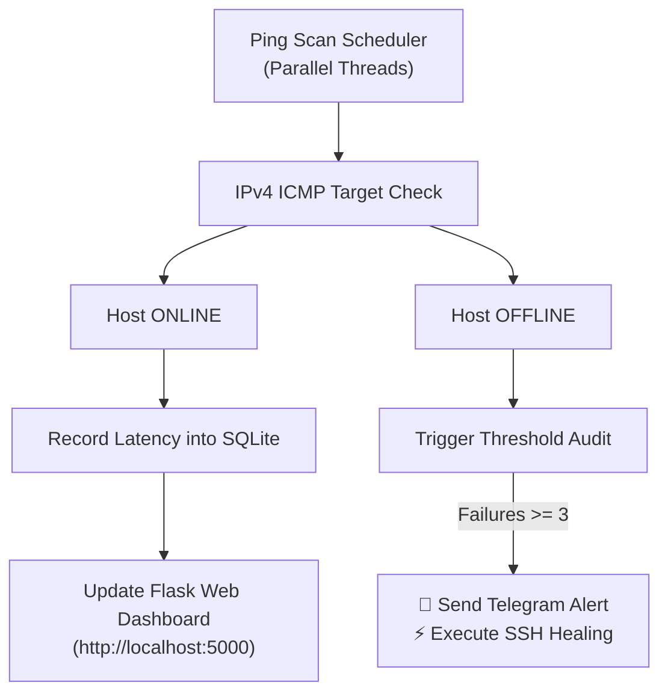

# 📡 Dawit Telecom Enterprise Network Health & Automated Self-Healing Suite

A robust, multi-threaded enterprise network health monitoring and incident response suite. Built with Python, it continuously audits node latency, dispatches instant notifications via Telegram, offers interactive REST/Web UI dashboards, and executes SSH recovery routines under node failures.

---

## 📐 System Architecture & Flowchart


---
## 📸 System Previews

### 1. Visual Web Dashboard (`http://localhost:5000`)
Real-time node telemetry dashboard status rendering:


### 2. Interactive Telegram Bot & Critical Incident Alerts
Instant outage notifications with inline controls for status queries.

🤖 Telegram Bot Interface Preview

🔴 CRITICAL ALERT: HOST DOWN

Node: 10.0.0.12

Failures: 3/3 Consecutive ICMP Drops

Action Taken: SSH Self-Healing Triggered

[ 📊 Live Status ] [ 🔄 Re-Check Node ]

### 3. Engine Telemetry Logs
Asynchronous multi-threaded execution traces showing ping scanning and dynamic fallback handling.

[INFO] [THREAD-1] Ping scan initiated for target subnet 192.168.1.0/24...
[SUCCESS] 192.168.1.1 is ONLINE (Latency: 12.4ms) -> SQLite Updated.
[WARNING] Target 10.0.0.12 failed ICMP response! (Failure count: 1/3)
[WARNING] Target 10.0.0.12 failed ICMP response! (Failure count: 2/3)
[CRITICAL] Target 10.0.0.12 Threshold Exceeded! (Failure count: 3/3)
[ACTION] Dispatching Telegram Alert to Admin...
[ACTION] Initiating Paramiko SSH Self-Healing Session on 10.0.0.12...

---

## 👥 User Guide (በተግባር እንዴት እንደሚሰራ)

1. **Passive Monitoring (Visual Dashboard):**
   * Open any browser and navigate to `http://localhost:5000`.
   * Monitor round-trip latency (RTT in ms) and online/offline statuses updated automatically every 10 seconds.

2. **Active Bot Monitoring:**
   * Open Telegram and query the bot.
   * Send `/status` or tap **`📊 Live Status`** for instantaneous host status reports.
   * Send `/check <IP_ADDRESS>` (e.g., `/check 8.8.8.8`) to run on-demand security-sanitized diagnostic checks.

3. **Incident Remediation:**
   * Upon detecting 3 consecutive ICMP host failures, the system executes SSH self-healing routines to restart failing services and alerts the engineer.

---

## 🛠️ Installation & Setup Guide

```bash
# 1. Clone Repository
git clone [https://github.com/YOUR_GITHUB_USERNAME/dawit-enterprise-network-monitor-autofix.git](https://github.com/YOUR_GITHUB_USERNAME/dawit-enterprise-network-monitor-autofix.git)
cd dawit-enterprise-network-monitor-autofix

# 2. Install Required Dependencies
pip install flask python-dotenv requests

# 3. Create .env file with your credentials


---

## ⚖️ System Evaluation: Strengths & Limitations

### 🟢 Core Strengths (የሲስተሙ ጠንካራ ጎኖች)
* **High-Performance Concurrency:** Uses asynchronous multi-threading to continuously monitor multiple IP nodes in parallel without execution blocking or latency buildup.
* **Full PC Cross-Platform Native Support:** Runs at 100% native capacity on desktop environments (Windows, Linux, macOS) with full ICMP, SSH (`paramiko`), and SMS gateway support.
* **Resilient Architecture & Graceful Degradation:** Built-in fallback mechanisms ensure system continuity; when restricted on mobile OS environments (Pydroid 3), it smoothly transitions into simulation mode without process crashes.
* **Enterprise Security Measures:** Strict input sanitization via Python's `ipaddress` module prevents command injection vulnerabilities on dynamic user inputs (`/check <IP>`).
* **Automated Data Lifecycle Management:** Dynamic log rotation archives telemetry history into monthly CSV structures, preventing SQLite database bloat over extended operation periods.
* **Multi-Interface Accessibility:** Offers dual-view monitoring—a dynamic Flask Web Analytics Dashboard for browsers and an event-driven Telegram Bot for mobile engineers.

---

### 🟡 Environment-Specific Limitations (የአካባቢ ውስንነቶች)
> **Note:** The core system code is fully functional for Enterprise PC/Server deployment. The following are mobile-runtime constraints only:

* **Mobile OS Compilation Constraints:** When deployed on mobile platforms (Android/Pydroid 3), C-compiled dependencies (like `cryptography/paramiko` for native SSH) require cross-compilation binaries, triggering the system's dynamic simulation fallback.
* **Single-Node Deployment:** The current engine operates as a centralized monitor; network partitions between the monitor and targets could trigger false-positive outage alerts.
* **Basic Authentication on Web UI:** The Flask web dashboard currently runs without localized HTTP Basic Auth or OAuth2 middleware, suitable for internal LANs or private VPNs.

---

## 🚀 Future Enhancements & Roadmap (ወደፊት የሚሻሻሉ ነገሮች)

1. **Distributed Agent Nodes:** Transitioning from a single centralized scanner to a distributed worker architecture (using Celery / Redis) for multi-region host auditing.
2. **Advanced Security Integration:** Implementing OAuth2 / JWT authentication layers for the Flask visual dashboard to support multi-tenant role-based access.
3. **Enhanced Visual Analytics:** Integrating `Chart.js` or `Grafana` connectors to display real-time latency graphs and historical uptime percentage metrics.
4. **Automated SMS & PagerDuty Integration:** Adding native PagerDuty API integrations alongside Twilio for enterprise-level escalation chains.


